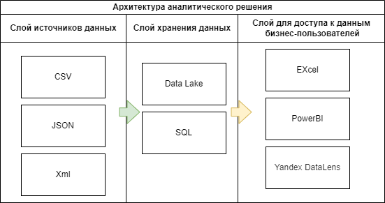

# Модуль 1 - Домашняя работа

## 1. Архитектура аналитического решения
Нашей первой задачей в этом модуле было нарисовать архитектуру верхнего уровня аналитического решения с помощью draw.io или аналогичных инструментов.

Архитектура должна состоять из трех слоев:

Исходный слой - слой источника данных
Storage Layer - уровень хранения данных
Business Layer — слой для доступа к данным бизнес-пользователей
В качестве возможного примера я выбрал сервис генерации изображений на основе ИИ (мобильный и веб-сервис), разработанный командой стартапа.

Ниже мое решение:

## 2. Создание дашборда в Excel

Затем нам пришлось создать панель инструментов в Excel из файла [Superstore.xls](source/Sample%20-%20Superstore.xls) с помощью Lookup, сводных таблиц и других функций Excel.

Superstore — это фиктивный набор данных. Он предоставляет подробную информацию о продажах для компании, которая продает различные продукты различным типам клиентов в США. Набор данных содержит информацию за 4 года (с 2016 по 2019 год).

Вот мой дашборд (скриншот):

И [моя панель инструментов] (source/Sample%20-%20Superstore%20-My.xls) со сводными таблицами в файле Excel.