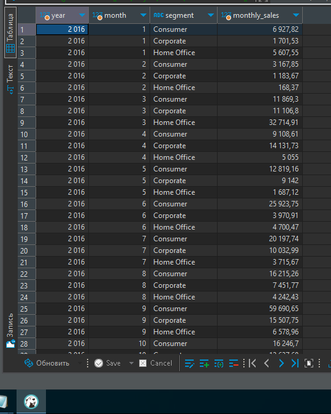
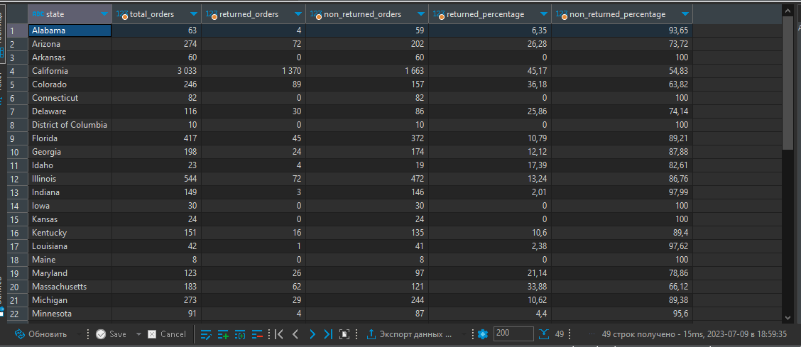
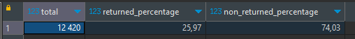
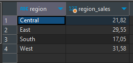
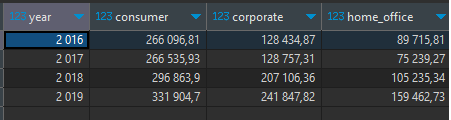
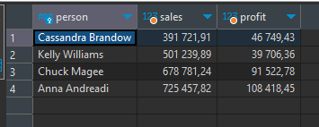
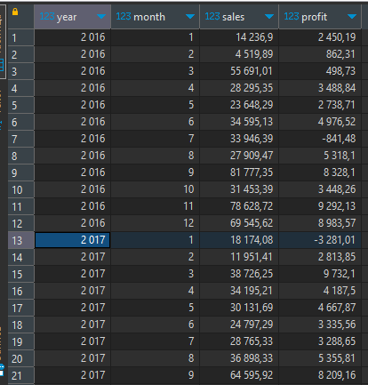
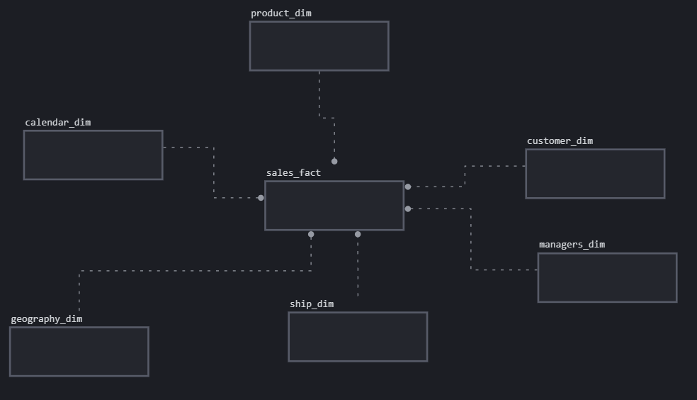
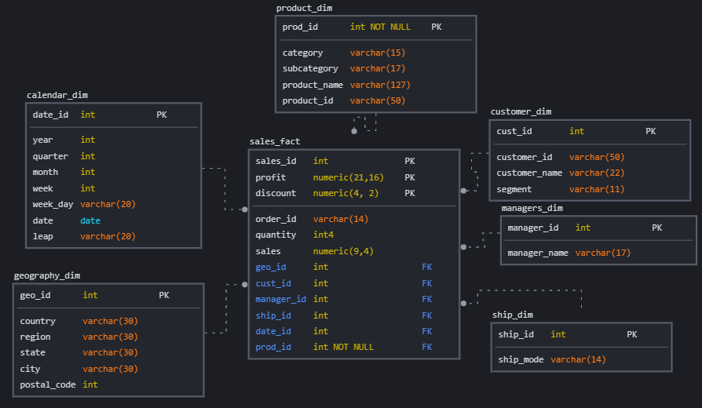
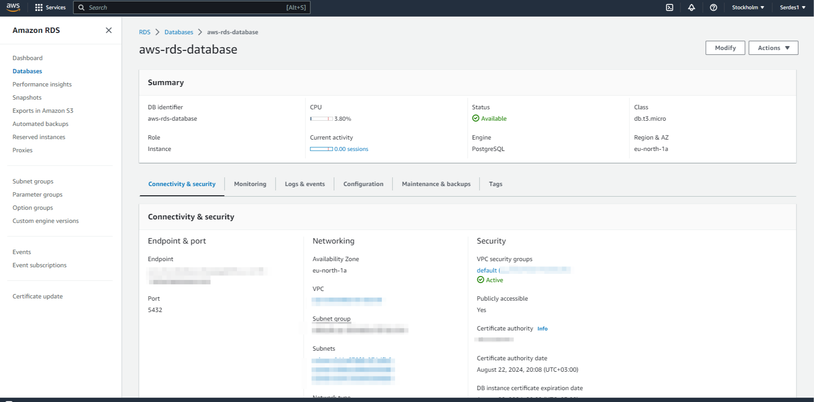

Модуль 2 - Домашняя работа

# 1. Подключение к Базам Данных и SQL
Мы установили клиент SQL для подключения базы данных (в нашем случае DBeaver).
Создаем 3 таблицы и загружаем данные из [Superstore Excel](<source/Sample - Superstore.xls>) файла в нашу базу данных. Сохраняем в вашем GitHub скрипт загрузки данных и создания таблиц. Загрузку данных можно произвести с помощью уже подготовленных [скриптов SQL} (https://github.com/Data-Learn/data-engineering/tree/master/DE-101%20Modules/Module01/DE%20-%20101%20Lab%201.1) или же можно подготовить csv файлы для каждой таблицы (сохранить как для каждого листа книги, и предварительно заменив разделитель дробной части с "," на ".") и произвести загрузку в SQL:

Напишем запросы, чтобы ответить на вопросы из Модуля 01.
Ниже мое решение:
# 3. SQL-запросы к базе данных
Ниже приведены примеры моих SQL-запросов к базе данных

## 3.1. Ежемесячные продажи по сегментам
```sql
select extract(year from order_date) as year,
 extract(month from order_date) as month,
 segment,
 round(sum(sales), 2) as monthly_sales
from orders
group by year, month, segment
order by year, month, segment;
```


## 3.2. Продажи и возвращенные и не возвращенные товары по штатам
```sql 
SELECT
    o.state,
    COUNT(*) AS total_orders,
    COUNT(r.returned) AS returned_orders,
    COUNT(o.order_id) - COUNT(r.returned) AS non_returned_orders,
    ROUND((COUNT(r.returned)::numeric/COUNT(*) * 100), 2)  AS   returned_percentage,
    ROUND(((COUNT(*) - COUNT(r.returned))::numeric/ COUNT(*)) * 100  , 2) AS non_returned_percentage
FROM
    public.orders AS o
LEFT JOIN
    public."returns" AS r ON o.order_id = r.order_id
GROUP BY
    o.state
ORDER BY
    o.state;
``` 


##### Если не объявлять тип данных, результатом для процентов будет либо 0 либо 100. Решить можно как у меня, указав корректный тип данных, либо сначала умножить на 100.00, а потом только делить.

## 3.3 Процент возвращенных заказов
```sql
SELECT
    --count(*) as Total,
    ROUND((COUNT(r.returned)::numeric / COUNT(*)) * 100, 2) AS returned_percentage,
    ROUND(((COUNT(*) - COUNT(r.returned))::numeric / COUNT(*)) * 100, 2) AS non_returned_percentage
FROM
    public.orders AS o
left JOIN
    public."returns" AS r ON o.order_id = r.order_id
```



## 3.4 Процент продаж по регионам
```sql
SELECT
    region,
    ROUND ((sum(sales)/(select sum(sales) from public.orders)) * 100, 2) AS region_sales
    FROM
    public.orders 
group by region
order by region;
```


## 3.5 Динамика продаж по сегментам
```sql
select
extract(year from order_date) as year,
--extract(month from order_date) as month,
round(SUM(CASE WHEN segment = 'Consumer' THEN sales ELSE 0 END), 2) as Consumer,
round(SUM(CASE WHEN segment = 'Corporate' THEN sales ELSE 0 END), 2) as Corporate,
round(SUM(CASE WHEN segment = 'Home Office' THEN sales ELSE 0 END), 2) as Home_Office
from orders
group by year--, month
order by year;--, month;
```


Если раскрыть комментарии (убрать "--" в SQL запросе), можно просмотреть динамику по месяцам.

## 3.6 Продажа и прибыль региональных менеджеров
```sql
SELECT
    p.person as Person,
    round(sum(sales), 2) as Sales,
    round(sum(Profit), 2) as  Profit
FROM
    public.orders AS o
LEFT JOIN
    public.people  AS p ON o.region = p.region
GROUP BY
     Person
ORDER BY
    Sales;
```


 ## 3.7 Динамика дохода и прибыли
 
 ```sql
 select
extract(year from order_date) as year,
extract(month from order_date) as month,
round(sum(sales), 2) as Sales,
round(sum(Profit), 2) as  Profit
from orders
group by year, month
order by year, month;
 ```


# 4. Создание модели данных
На этом этапе нас попросили создать многомерную модель данных (концептуальную, логическую и физическую схему). Для этого я использовал SQLdbm, инструмент, предложенный автором курса.

## Концептуальная схема


## Физическая схема


Мой [SQL-скрипт ](source/Task4_1.sql) для создания модели данных.
[SQL-крипт](source/Task4_2.sql)  для наполнения данными.

# 5. Подключение к облачной базе данных
Нашей следующей задачей было создать базу данных на облачном сервере AWS и загрузить наши данные для промежуточного уровня и размерную модель для бизнес-уровня. Были сложности при [создании учетной записи в AWS](https://github.com/Data-Learn/data-engineering/blob/master/how-to/How%20to%20create%20AWS%20Account.md), но могала эта [статья](https://conff.org/guides/1934-account-registration-aws-russia.html). Для создания базы данных в облаке я использовал эту [инструкцию](https://github.com/Data-Learn/data-engineering/blob/master/how-to/how_to_amazon_rds.md), а для загрузки SQL-файлы, подготовленные автором курса.

Промежуточный [stg.orders.sql](https://github.com/Data-Learn/data-engineering/blob/03f51ea85791fb1d6a86659bba3040db0b98471b/DE-101%20Modules/Module02/DE%20-%20101%20Lab%202.1/stg.orders.sql)

Бизнес-уровень из [from_stg_to_dw_sql](https://github.com/Data-Learn/data-engineering/blob/03f51ea85791fb1d6a86659bba3040db0b98471b/DE-101%20Modules/Module02/DE%20-%20101%20Lab%202.1/from_stg_to_dw.sql)


## Моя облачная база данных на AWS 


## Обновлена база данных в Dbeaver


